# بلدية تكريت - تحليل هيكل المشروع وقاعدة البيانات
# Tekrit Municipality Website - Project & Database Analysis

> **تاريخ التوثيق:** 2026-04-29  
> **نوع المشروع:** موقع بلدية تكريت الإلكتروني (Municipal Website)  
> **حالة المشروع:** قيد التطوير والتشغيل  

---

## 1. نظرة عامة على المشروع (General Project Overview)

المشروع هو **نظام إدارة بلدية تكريت الشامل** - منصة إلكترونية متكاملة تخدم كل من:

1. **المواطنين (Public Website):** موقع عام يتيح للمواطنين تقديم الطلبات، متابعة الشكاوى، الاطلاع على الأخبار والمشاريع، والتطوع في المبادرات البيئية.
2. **الموظفين والإدارة (Admin Panel):** لوحة تحكم شاملة لإدارة كافة عمليات البلدية تشمل: الإدارة المالية، المشاريع، الموارد البشرية، الشكاوى، المرافق، الآليات، النفايات، والتواصل مع المواطنين.

### الوحدات الرئيسية:
- 🏛️ إدارة البلدية والمجلس البلدي واللجان
- 💰 النظام المالي (ميزانيات، فواتير، ضرائب، تبرعات)
- 🏗️ إدارة المشاريع والمساهمات الشعبية
- 👥 خدمات المواطنين (طلبات، شكاوى، حسابات)
- 🚚 إدارة الآليات والصيانة والنفايات
- 🗺️ خريطة المرافق العامة
- 📰 إدارة الأخبار والمحتوى العام
- 🌱 المبادرات البيئية والشبابية
- 🔗 الروابط المهمة (Auto-fetching من مصادر خارجية)
- ✈️ نظام إشعارات Telegram
- 🤖 تكامل ذكاء اصطناعي (Gemini AI) لتوليد الميزانيات

---

## 2. بيئة التطوير المحلية (Local Development Environment)

| العنصر | القيمة |
|--------|--------|
| **الخادم المحلي** | XAMPP |
| **رابط المشروع** | `http://localhost:8080/tekrit_municipality/` |
| **قاعدة البيانات** | `tekrit_municipality` |
| **نوع قاعدة البيانات** | MySQL (InnoDB) |
| **مستخدم قاعدة البيانات** | `root` (بدون كلمة مرور) |
| **ترميز الحروف** | `utf8mb4` / `utf8mb4_unicode_ci` |
| **لغة البرمجة** | PHP (مع PDO) |
| **المكتبات الأمامية** | TailwindCSS (CDN), Chart.js, AlpineJS, Cairo Font |
| **المسار على القرص** | `c:\xampp\htdocs\tekrit_municipality\` |

---

## 3. هيكل مجلدات المشروع (Project Folder Structure)

```
tekrit_municipality/
├── index.php                          # إعادة توجيه للصفحة الرئيسية العامة
├── login.php                          # صفحة تسجيل دخول الموظفين
├── logout.php                         # تسجيل الخروج
├── reset_password.php                 # إعادة تعيين كلمة المرور
├── comprehensive_dashboard.php        # لوحة التحكم الشاملة (الرئيسية للموظفين)
├── all_tables_manager.php             # مدير الجداول المرجعية
│
├── config/                            # ⚙️ ملفات الإعدادات
│   ├── config.php                     #   إعدادات النظام الأساسية
│   ├── database.php                   #   كلاس اتصال قاعدة البيانات (PDO)
│   ├── api_config.php                 #   إعدادات API
│   ├── api_keys.php.example           #   نموذج مفاتيح API
│   ├── database_example.php           #   نموذج إعدادات قاعدة البيانات
│   └── database_hosting_example.php   #   نموذج إعدادات للاستضافة
│
├── includes/                          # 📦 المكونات المشتركة والمكتبات
│   ├── auth.php                       #   نظام المصادقة (Auth class)
│   ├── auth_helper.php                #   دوال مساعدة للصلاحيات
│   ├── auth_hosting.php               #   نسخة المصادقة للاستضافة
│   ├── Database.php                   #   كلاس قاعدة بيانات محسّن (Singleton)
│   ├── SessionManager.php             #   مدير الجلسات المحسّن
│   ├── CsrfProtection.php             #   حماية CSRF
│   ├── SecurityHeaders.php            #   رؤوس أمان HTTP
│   ├── ApiSecurity.php                #   أمان API
│   ├── Validator.php                  #   التحقق من المدخلات
│   ├── Logger.php                     #   نظام السجلات
│   ├── ErrorHandler.php               #   معالج الأخطاء
│   ├── Cache.php                      #   نظام التخزين المؤقت
│   ├── FileUpload.php                 #   رفع الملفات
│   ├── TelegramService.php            #   خدمة Telegram
│   ├── WhatsAppService.php            #   خدمة WhatsApp (قديم)
│   ├── CitizenRequest.php             #   كلاس طلبات المواطنين
│   ├── CitizenAccountHelper.php       #   مساعد حسابات المواطنين
│   ├── RequestType.php                #   أنواع الطلبات
│   ├── ImportantLinksFetcher.php      #   جالب الروابط المهمة
│   ├── LoginAttemptsTracker.php       #   تتبع محاولات تسجيل الدخول
│   ├── Utils.php                      #   أدوات عامة
│   ├── menu_config.php                #   إعدادات القائمة الجانبية
│   ├── currency_formatter.php         #   تنسيق العملات
│   ├── currency_helper.php            #   مساعد العملات
│   ├── helpers.php                    #   دوال مساعدة عامة
│   ├── form_helper.php                #   مساعد النماذج
│   ├── csrf_helper.php                #   مساعد CSRF
│   ├── csrf_middleware.php            #   وسيط CSRF
│   ├── recaptcha_helper.php           #   مساعد reCAPTCHA
│   ├── settings_helper.php            #   مساعد الإعدادات
│   ├── ai_budget_questions.php        #   أسئلة الميزانية بالذكاء الاصطناعي
│   ├── ai_helper.php                  #   مساعد الذكاء الاصطناعي
│   ├── ai_service.php                 #   خدمة الذكاء الاصطناعي
│   ├── init_phase1.php                #   تهيئة المرحلة الأولى
│   ├── init_security.php              #   تهيئة الأمان
│   ├── auto_security.php              #   أمان تلقائي
│   └── mappers/                       #   مصادر بيانات خارجية
│       ├── BaseMapper.php
│       ├── EmbassiesMapper.php
│       ├── GovernmentDirectoryMapper.php
│       └── HospitalsMapper.php
│
├── modules/                           # 📋 وحدات لوحة التحكم الإدارية (98 ملف)
│   ├── municipality_management.php    #   إدارة البلدية
│   ├── council_management.php         #   المجلس البلدي
│   ├── committee_dashboard.php        #   لوحة اللجان
│   ├── hr.php                         #   الموارد البشرية
│   ├── departments.php                #   الأقسام
│   ├── permissions.php                #   الصلاحيات
│   ├── finance.php                    #   المعاملات المالية
│   ├── financial_dashboard.php        #   لوحة مالية
│   ├── budgets.php                    #   الميزانيات
│   ├── suppliers.php                  #   الموردون
│   ├── invoices.php                   #   الفواتير
│   ├── tax_collection.php             #   الجباية
│   ├── tax_types.php                  #   أنواع الضرائب
│   ├── donations.php                  #   التبرعات
│   ├── contributions.php              #   المساهمات الشعبية
│   ├── currencies.php                 #   العملات
│   ├── projects_unified.php           #   إدارة المشاريع الموحدة
│   ├── projects_finance.php           #   التتبع المالي للمشاريع
│   ├── contracts.php                  #   العقود والمناقصات
│   ├── donor_organizations.php        #   المنظمات المانحة
│   ├── citizens.php                   #   إدارة المواطنين
│   ├── citizens_accounts.php          #   حسابات المواطنين
│   ├── complaints.php                 #   الشكاوى
│   ├── building_permit.php            #   رخص البناء
│   ├── violations.php                 #   المخالفات
│   ├── citizen_requests_stats.php     #   إحصائيات طلبات المواطنين
│   ├── citizen_ratings.php            #   تقييمات المواطنين
│   ├── vehicles.php                   #   الآليات
│   ├── drivers_section.php            #   السائقون
│   ├── maintenance.php                #   الصيانة
│   ├── waste.php                      #   النفايات
│   ├── inventory.php                  #   المخزون
│   ├── facilities_management.php      #   إدارة المرافق
│   ├── facilities_categories.php      #   فئات المرافق
│   ├── map_settings.php               #   إعدادات الخريطة
│   ├── public_content_management.php  #   إدارة المحتوى العام (256KB - ملف كبير جداً)
│   ├── news_management_new.php        #   إدارة الأخبار
│   ├── important_links_management.php #   إدارة الروابط المهمة
│   ├── contact_management.php         #   إدارة رسائل اتصل بنا
│   ├── telegram_messages.php          #   رسائل Telegram
│   ├── telegram_settings.php          #   إعدادات Telegram
│   ├── sms.php                        #   الرسائل النصية
│   ├── reports.php                    #   التقارير
│   ├── archive.php                    #   الأرشيف الإلكتروني
│   ├── system_settings.php            #   إعدادات النظام
│   ├── update_citizen_request.php     #   تحديث طلبات المواطنين
│   ├── view_citizen_request.php       #   عرض طلب مواطن
│   ├── budget_ai_component.php        #   مكون الميزانية بالذكاء الاصطناعي
│   ├── budgets_report.php             #   تقرير الميزانيات
│   ├── print_invoice.php              #   طباعة الفواتير
│   └── [+48 ملف آخر بما فيها backups و fixed و test files]
│
├── public/                            # 🌐 الموقع العام للمواطنين
│   ├── index.php                      #   الصفحة الرئيسية
│   ├── news.php                       #   قائمة الأخبار
│   ├── news-detail.php                #   تفاصيل خبر
│   ├── projects.php                   #   المشاريع
│   ├── project-detail.php             #   تفاصيل مشروع
│   ├── initiatives.php                #   المبادرات
│   ├── initiative-detail.php          #   تفاصيل مبادرة
│   ├── council.php                    #   المجلس البلدي
│   ├── committees.php                 #   اللجان البلدية
│   ├── contact.php                    #   اتصل بنا
│   ├── facilities-map.php             #   خريطة المرافق
│   ├── important-links.php            #   الروابط المهمة
│   ├── citizen-requests.php           #   تقديم طلبات (95KB - ملف كبير)
│   ├── citizen-complaints.php         #   تقديم شكاوى
│   ├── citizen-dashboard.php          #   لوحة المواطن
│   ├── citizen-request-details.php    #   تفاصيل طلب
│   ├── track-request.php              #   متابعة الطلب
│   ├── track-complaint.php            #   متابعة الشكوى
│   ├── login.php                      #   تسجيل دخول المواطنين
│   ├── telegram_webhook.php           #   Webhook لـ Telegram
│   ├── includes/                      #   مكونات مشتركة للموقع العام
│   │   ├── header.php                 #     الرأس
│   │   └── footer.php                 #     التذييل
│   ├── assets/                        #   ملفات الأصول
│   │   ├── css/                       #     أنماط CSS
│   │   │   ├── tekrit-theme.css
│   │   │   ├── loading-screen.css
│   │   │   ├── citizen-requests.css
│   │   │   ├── enhanced-style.css
│   │   │   └── footer-enhancements.css
│   │   ├── images/                    #     الصور
│   │   │   ├── Tekrit_LOGO.png
│   │   │   ├── Tekrit_LOGO.jpg
│   │   │   ├── hero/                  #       صور البطل
│   │   │   └── initiatives/           #       صور المبادرات
│   │   └── js/                        #     JavaScript
│   ├── api/                           #   API عام
│   │   └── get_important_links.php
│   └── uploads/                       #   مجلد رفع ملفات عام (فارغ)
│
├── admin/                             # 👑 لوحة إدارة المبادرات
│   ├── initiatives.php                #   قائمة المبادرات
│   ├── add_initiative.php             #   إضافة مبادرة
│   ├── edit_initiative.php            #   تعديل مبادرة
│   └── manage_initiative_images.php   #   إدارة صور المبادرات
│
├── api/                               # 🔌 واجهات برمجة التطبيقات
│   ├── ai_budget_generate.php         #   توليد ميزانية بالذكاء الاصطناعي
│   ├── ai_content_generate.php        #   توليد محتوى بالذكاء الاصطناعي
│   ├── finance.php                    #   API مالي
│   ├── financial_transactions.php     #   API المعاملات المالية
│   ├── get_currencies.php             #   جلب العملات
│   ├── get_gemini_models.php          #   نماذج Gemini
│   ├── test_ai_connection.php         #   اختبار اتصال AI
│   └── budget_questions.json          #   أسئلة الميزانية (JSON)
│
├── ajax/                              # ⚡ طلبات AJAX
│   ├── add-comment.php                #   إضافة تعليق
│   ├── get-form-fields.php            #   جلب حقول النموذج
│   ├── get-request-details.php        #   تفاصيل الطلب
│   └── update-request.php             #   تحديث طلب
│
├── uploads/                           # 📁 مجلد رفع الملفات الرئيسي
│   ├── council_members/               #   صور أعضاء المجلس
│   ├── documents/                     #   المستندات
│   ├── facilities/                    #   صور المرافق
│   ├── initiatives/                   #   صور المبادرات
│   ├── news/                          #   صور الأخبار
│   ├── requests/                      #   مرفقات الطلبات
│   └── test_security.php              #   ⚠️ ملف اختبار أمان (لا ينبغي أن يكون هنا)
│
├── database/ (sql/)                   # 🗄️ ملفات قاعدة البيانات (58+ ملف)
│   ├── schema.sql                     #   المخطط الأساسي
│   ├── tekrit_municipality.sql        #   نسخة كاملة (426KB)
│   ├── stored_procedures.sql          #   الإجراءات المخزنة
│   ├── comprehensive_schema.sql       #   مخطط شامل
│   └── [+55 ملف migration و setup و fix]
│
├── scripts/                           # 🛠️ سكربتات تشغيل
│   ├── add_csrf_batch.php
│   └── add_csrf_to_all_forms.php
│
├── cron/                              # ⏰ مهام مجدولة
│   └── fetch_important_links.php      #   جلب الروابط المهمة تلقائياً
│
├── cache/                             # 💾 ملفات التخزين المؤقت
│   └── [5 ملفات .cache]
│
├── logs/                              # 📝 ملفات السجلات
│   ├── app_YYYY-MM-DD.log
│   ├── errors_YYYY-MM-DD.log
│   └── telegram_webhook.log
│
├── docs/                              # 📖 التوثيق
│   └── AI_INTEGRATION_GUIDE.md
│
├── js/                                # 📜 JavaScript عام
│   └── ai_helper.js
│
├── tekrit_municipality/               # ⚠️ نسخة مكررة من المشروع (مشكلة)
│   └── [153 ملف - نسخة قديمة من المشروع]
│
└── [+150 ملف documentation/fix/test/setup في الجذر]
```

### ملاحظات على الهيكل:
- ⚠️ **المجلد `tekrit_municipality/` داخل المشروع** يحتوي نسخة مكررة قديمة - يجب حذفها أو إزالتها من Git.
- ⚠️ **وجود 150+ ملف documentation وtest وfix في الجذر** - يجب تنظيمها في مجلدات فرعية.
- ⚠️ **ملفات backup كثيرة** بالمجلدات (مثل `council_management_backup.php`, `council_management_fixed.php`).

---

## 4. ملفات PHP الرئيسية والصفحات (Main PHP Files and Pages)

### ملفات الجذر الأساسية:

| الملف | الغرض | الحجم |
|-------|--------|-------|
| `index.php` | إعادة توجيه إلى `public/index.php` | 54B |
| `login.php` | تسجيل دخول الموظفين | 7.9KB |
| `logout.php` | تسجيل خروج | 138B |
| `reset_password.php` | إعادة تعيين كلمة المرور | 14.5KB |
| `comprehensive_dashboard.php` | لوحة التحكم الشاملة | 88.7KB |
| `all_tables_manager.php` | مدير الجداول المرجعية | 40KB |

### ملفات Setup/Migration في الجذر (يجب نقلها):

| الملف | الغرض |
|-------|--------|
| `check_and_create_tables.php` | فحص وإنشاء الجداول |
| `setup_citizen_accounts_system.php` | إعداد حسابات المواطنين |
| `setup_financial_system.php` | إعداد النظام المالي |
| `setup_facilities_map.php` | إعداد خريطة المرافق |
| `install_stored_procedures.php` | تثبيت الإجراءات المخزنة |
| `migrate_to_telegram.php` | ترحيل إلى Telegram |
| `fix_admin_password.php` | إصلاح كلمة مرور المدير |

---

## 5. هيكل لوحة التحكم الإدارية (Admin Panel Structure)

### نقطة الدخول:
- تسجيل الدخول عبر `login.php` → توجيه إلى `comprehensive_dashboard.php`
- لوحة التحكم تستخدم **نظام SPA جزئي** حيث يتم تحميل الأقسام ديناميكياً

### مجلد `admin/` - لوحة إدارة المبادرات:
| الملف | الغرض |
|-------|--------|
| `initiatives.php` | عرض قائمة المبادرات |
| `add_initiative.php` | إضافة مبادرة جديدة |
| `edit_initiative.php` | تعديل مبادرة |
| `manage_initiative_images.php` | إدارة صور المبادرات |

### مجلد `modules/` - الوحدات الإدارية الرئيسية (98 ملف):

#### 🏛️ الإدارة العامة:
| الملف | الغرض | الحجم |
|-------|--------|-------|
| `municipality_management.php` | إدارة البلدية الشاملة | 99KB |
| `council_management.php` | المجلس البلدي | 41KB |
| `committee_dashboard.php` | لوحة اللجان | 90KB |
| `hr.php` | الموارد البشرية | 67KB |
| `departments.php` | إدارة الأقسام | 44.5KB |
| `permissions.php` | إدارة الصلاحيات | 58KB |

#### 💰 النظام المالي:
| الملف | الغرض | الحجم |
|-------|--------|-------|
| `financial_dashboard.php` | لوحة التحكم المالية | 33KB |
| `finance.php` | المعاملات المالية | 60KB |
| `budgets.php` | الميزانيات | 88.5KB |
| `suppliers.php` | الموردون | 41KB |
| `invoices.php` | الفواتير | 58KB |
| `tax_collection.php` | الجباية | 72KB |
| `tax_types.php` | أنواع الضرائب | 38KB |
| `donations.php` | التبرعات | 26KB |
| `contributions.php` | المساهمات الشعبية | 38KB |
| `currencies.php` | العملات | 26KB |

#### 🏗️ المشاريع:
| الملف | الغرض | الحجم |
|-------|--------|-------|
| `projects_unified.php` | إدارة المشاريع الموحدة | 65KB |
| `projects_finance.php` | التتبع المالي للمشاريع | 46KB |
| `contracts.php` | العقود والمناقصات | 7KB |
| `donor_organizations.php` | المنظمات المانحة | 33KB |

#### 👥 خدمات المواطنين:
| الملف | الغرض | الحجم |
|-------|--------|-------|
| `citizens.php` | إدارة المواطنين | 82KB |
| `citizens_accounts.php` | حسابات المواطنين | 15KB |
| `complaints.php` | الشكاوى | 53KB |
| `building_permit.php` | رخص البناء | 24KB |
| `update_citizen_request.php` | تحديث طلبات المواطنين | 37.5KB |
| `view_citizen_request.php` | عرض طلب مواطن | 24KB |

#### 🌐 الموقع والاتصالات:
| الملف | الغرض | الحجم |
|-------|--------|-------|
| `public_content_management.php` | إدارة المحتوى العام | **256KB** ⚠️ |
| `important_links_management.php` | إدارة الروابط المهمة | 53KB |
| `contact_management.php` | إدارة رسائل اتصل بنا | 41KB |
| `telegram_messages.php` | رسائل Telegram | 16KB |
| `telegram_settings.php` | إعدادات Telegram | 17KB |
| `system_settings.php` | إعدادات النظام | 46KB |

---

## 6. هيكل الموقع العام (Public Website Structure)

الموقع العام يقع في مجلد `public/` ويتكون من الصفحات التالية:

### الصفحات الرئيسية:

| الصفحة | الملف | الغرض |
|--------|-------|--------|
| الرئيسية | `index.php` | عرض أخبار مميزة، مشاريع، مبادرات، إحصائيات |
| الأخبار | `news.php` | قائمة الأخبار والأنشطة |
| تفاصيل خبر | `news-detail.php` | عرض تفاصيل خبر واحد |
| المشاريع | `projects.php` | عرض مشاريع التطوير |
| تفاصيل مشروع | `project-detail.php` | تفاصيل مشروع مع المساهمات |
| المبادرات | `initiatives.php` | المبادرات البيئية والشبابية |
| تفاصيل مبادرة | `initiative-detail.php` | تفاصيل مبادرة مع التسجيل |
| المجلس البلدي | `council.php` | أعضاء المجلس البلدي |
| اللجان | `committees.php` | اللجان البلدية |
| خريطة المرافق | `facilities-map.php` | خريطة تفاعلية للمرافق |
| اتصل بنا | `contact.php` | نموذج التواصل |
| الروابط المهمة | `important-links.php` | روابط خارجية مهمة |

### خدمات المواطنين الإلكترونية:

| الصفحة | الملف | الغرض |
|--------|-------|--------|
| تقديم طلب | `citizen-requests.php` | نموذج تقديم طلب جديد |
| متابعة طلب | `track-request.php` | تتبع حالة الطلب |
| تقديم شكوى | `citizen-complaints.php` | نموذج تقديم شكوى |
| متابعة شكوى | `track-complaint.php` | تتبع حالة الشكوى |
| لوحة المواطن | `citizen-dashboard.php` | لوحة تحكم شخصية |
| تفاصيل الطلب | `citizen-request-details.php` | تفاصيل طلب المواطن |
| تسجيل دخول | `login.php` | تسجيل دخول المواطنين |

### التصميم والواجهة:
- خط **Cairo** العربي من Google Fonts
- **TailwindCSS CDN** للتنسيق
- ثيم مخصص في `tekrit-theme.css`
- شاشة تحميل متحركة (`loading-screen.css`)
- تصميم متجاوب (Responsive) مع دعم الجوال
- اتجاه **RTL** (من اليمين لليسار)

---

## 7. المكونات المشتركة والملفات المضمنة (Shared Components and Includes)

### ملفات الإعداد (Config):

| الملف | الغرض |
|-------|--------|
| `config/config.php` | الثوابت الأساسية: اسم الموقع، رابط الموقع، إعدادات DB، CSRF، حجم الملفات |
| `config/database.php` | كلاس `Database` مع PDO (في `config/`) |
| `includes/Database.php` | كلاس `Database` محسّن مع Singleton Pattern (في `includes/`) |

> ⚠️ **ملاحظة:** يوجد كلاسان مختلفان باسم `Database` - واحد في `config/` وآخر في `includes/`. هذا يسبب تعارضاً محتملاً.

### نظام المصادقة:

| الملف | الغرض |
|-------|--------|
| `includes/auth.php` | كلاس `Auth` الرئيسي: تسجيل دخول/خروج، التحقق من الجلسة |
| `includes/auth_helper.php` | دوال مساعدة: `hasPermission()`, `requireLogin()`, `logUserActivity()` |
| `includes/SessionManager.php` | مدير جلسات محسّن مع حماية Session Fixation/Hijacking |
| `includes/LoginAttemptsTracker.php` | تتبع محاولات الدخول الفاشلة وحظر مؤقت |

### نظام الأمان:

| الملف | الغرض |
|-------|--------|
| `includes/CsrfProtection.php` | توليد والتحقق من CSRF tokens |
| `includes/SecurityHeaders.php` | رؤوس أمان HTTP |
| `includes/ApiSecurity.php` | أمان واجهات API |
| `includes/Validator.php` | التحقق من المدخلات |
| `includes/recaptcha_helper.php` | حماية reCAPTCHA |

### المكونات المشتركة للموقع العام:

| الملف | الغرض |
|-------|--------|
| `public/includes/header.php` | رأس الصفحات العامة (شريط التنقل مع Logo) |
| `public/includes/footer.php` | تذييل الصفحات العامة |

### القائمة الجانبية:
- `includes/menu_config.php` يحتوي على خريطة كاملة لعناصر القائمة مع صلاحيات كل عنصر
- القائمة مقسمة لـ 9 فئات: الإدارة العامة، النظام المالي، المشاريع، خدمات المواطنين، الخدمات والصيانة، الخرائط، الموقع والاتصالات، التقارير، الإعدادات.

---

## 8. هيكل قاعدة البيانات (Database Structure)

قاعدة البيانات تحتوي على **101 جدول/عرض** منها **96 جدول عادي** و**5 Views**.

### الجداول الأساسية:

| اسم الجدول | الغرض | الأعمدة الرئيسية | المفتاح الأساسي | ملفات PHP المرتبطة | عدد السجلات |
|------------|--------|------------------|----------------|--------------------|------------|
| `users` | مستخدمو النظام (موظفون ومدراء) | id, username, password, full_name, email, phone, department_id, role_id, is_active, salary_currency_id | id | auth.php, hr.php, permissions.php | 9 |
| `roles` | أدوار المستخدمين | id, role_name, description | id | permissions.php | 3 |
| `permissions` | صلاحيات النظام | id, permission_name, description, category, is_active | id | permissions.php, auth_helper.php | 118 |
| `user_permissions` | ربط المستخدمين بالصلاحيات | id, user_id, permission_id, is_active, granted_by_user_id | id | auth_helper.php, permissions.php | 119 |
| `departments` | أقسام البلدية | id, name, description, head_id, is_active | id | departments.php, hr.php | 18 |
| `positions` | المناصب الوظيفية | id, title, department_id, level | id | hr.php | 8 |

### جداول المواطنين:

| اسم الجدول | الغرض | الأعمدة الرئيسية | المفتاح الأساسي | ملفات PHP المرتبطة | عدد السجلات |
|------------|--------|------------------|----------------|--------------------|------------|
| `citizens` | سجل المواطنين | id, full_name, national_id, phone, address, registration_date | id | citizens.php, tax_collection.php | 5 |
| `citizens_accounts` | حسابات المواطنين الإلكترونية | id, citizen_name, phone, access_code, telegram_chat_id, telegram_username | id | citizen-dashboard.php, citizen-requests.php | 2 |
| `citizen_requests` | طلبات المواطنين | id, tracking_number, citizen_name, phone, request_type_id, status, created_at | id | citizen-requests.php, update_citizen_request.php | 63 |
| `request_types` | أنواع الطلبات | id, type_name, description, required_documents, cost, cost_currency_id | id | citizen-requests.php | 38 |
| `request_documents` | مرفقات الطلبات | id, request_id, file_name, file_path, file_type | id | citizen-requests.php | 42 |
| `request_updates` | تحديثات حالة الطلبات | id, request_id, status, comment, updated_by | id | update_citizen_request.php | 75 |
| `request_form_data` | بيانات نماذج الطلبات | id, request_id, field_name, field_value | id | citizen-requests.php | 0 |
| `request_ratings` | تقييمات الطلبات | id, request_id, rating, comment | id | citizen_ratings.php | 1 |
| `citizen_messages` | رسائل المواطنين | id, citizen_id, message, priority, is_read | id | telegram_messages.php | 0 |
| `citizen_sessions` | جلسات المواطنين | id, citizen_id, session_token, expires_at | id | citizen-dashboard.php | 0 |
| `citizen_opinions` | آراء المواطنين | id, subject, opinion, citizen_name | id | - | 0 |
| `magic_links` | روابط سحرية للدخول | id, citizen_id, token, expires_at, is_used | id | login.php (public) | 2 |
| `notification_preferences` | تفضيلات الإشعارات | id, citizen_id, notify_email, notify_telegram | id | - | 1 |

### جداول الشكاوى:

| اسم الجدول | الغرض | الأعمدة الرئيسية | المفتاح الأساسي | ملفات PHP المرتبطة | عدد السجلات |
|------------|--------|------------------|----------------|--------------------|------------|
| `complaints` | الشكاوى | id, tracking_number, citizen_id, citizen_name, category_id, status, assigned_to | id | complaints.php, citizen-complaints.php | 2 |
| `complaint_categories` | فئات الشكاوى | id, category_name, responsible_department_id | id | complaints.php | 6 |
| `complaint_statuses` | حالات الشكاوى | id, status_name, color | id | complaints.php | 5 |
| `complaint_updates` | تحديثات الشكاوى | id, complaint_id, status, comment, updated_by | id | complaints.php | 3 |

### جداول النظام المالي:

| اسم الجدول | الغرض | الأعمدة الرئيسية | المفتاح الأساسي | ملفات PHP المرتبطة | عدد السجلات |
|------------|--------|------------------|----------------|--------------------|------------|
| `financial_transactions` | المعاملات المالية | id, type, amount, currency_id, category, description, created_by, approved_by, committee_id, related_project_id | id | finance.php, financial_dashboard.php | 10 |
| `budgets` | الميزانيات | id, title, fiscal_year, total_amount, status | id | budgets.php | 1 |
| `budget_items` | بنود الميزانية | id, budget_id, item_name, allocated_amount, spent_amount | id | budgets.php | 14 |
| `budget_item_templates` | قوالب بنود الميزانية | id, template_name, category | id | budget_ai_component.php | 25 |
| `fiscal_periods` | الفترات المالية | id, period_name, start_date, end_date | id | finance.php | 4 |
| `currencies` | العملات المدعومة | id, currency_name, currency_code, symbol, exchange_rate | id | currencies.php | 2 |
| `currency_conversion_log` | سجل تحويل العملات | id, from_currency_id, to_currency_id, amount, rate, project_id | id | - | 0 |
| `tax_types` | أنواع الضرائب | id, type_name, rate, currency_id | id | tax_types.php | 2 |
| `tax_collections` | تحصيلات الضرائب | id, citizen_id, tax_type_id, amount, currency_id, paid_date | id | tax_collection.php | 2 |
| `suppliers` | الموردون | id, company_name, contact_name, phone, address | id | suppliers.php | 1 |
| `supplier_invoices` | فواتير الموردين | id, supplier_id, invoice_number, amount, currency_id, status, committee_id | id | invoices.php | 3 |
| `invoice_payments` | دفعات الفواتير | id, invoice_id, amount, payment_date, committee_id | id | invoices.php | 3 |

### جداول المشاريع:

| اسم الجدول | الغرض | الأعمدة الرئيسية | المفتاح الأساسي | ملفات PHP المرتبطة | عدد السجلات |
|------------|--------|------------------|----------------|--------------------|------------|
| `projects` | المشاريع (جدول موحد) | id, name, type_id, status, budget, manager_id, budget_currency_id, contributions_currency_id | id | projects_unified.php, contributions.php | 1 |
| `development_projects` | مشاريع التطوير (قديم) | id, project_name, project_description, project_status, project_location, project_base_cost, completion_percentage | id | public/projects.php | 5 |
| `project_types` | أنواع المشاريع | id, type_name | id | projects_unified.php | 5 |
| `project_phases` | مراحل المشاريع | id, project_id, phase_name, start_date, end_date, status | id | projects_unified.php | 0 |
| `project_contributions` | المساهمات الشعبية | id, project_id, contributor_name, amount, currency_id, is_verified | id | contributions.php | 0 |

> ⚠️ **ملاحظة:** يوجد جدولان للمشاريع (`projects` و `development_projects`) - تم توحيدهما لكن الجدول القديم لا يزال مستخدماً في الموقع العام.

### جداول البلدية واللجان:

| اسم الجدول | الغرض | المفتاح الأساسي | ملفات PHP المرتبطة | عدد السجلات |
|------------|--------|----------------|--------------------|------------|
| `council_members` | أعضاء المجلس البلدي | id | council_management.php | 3 |
| `municipal_committees` | اللجان البلدية | id | committee_dashboard.php | 5 |
| `committee_members` | أعضاء اللجان | id | committee_dashboard.php | 0 |
| `committee_sessions` | جلسات اللجان | id | committee_dashboard.php | 2 |
| `committee_decisions` | قرارات اللجان | id | committee_dashboard.php | 0 |
| `committee_finance_summary` | ملخص مالي للجان | id | committee_dashboard.php | 5 |
| `committee_finance_transactions` | معاملات مالية للجان | id | committee_dashboard.php | 0 |
| `municipal_sessions` | جلسات المجلس البلدي | id | municipality_management.php | 0 |
| `municipal_decisions` | قرارات المجلس البلدي | id | municipality_management.php | 0 |

### جداول المرافق والخريطة:

| اسم الجدول | الغرض | المفتاح الأساسي | ملفات PHP المرتبطة | عدد السجلات |
|------------|--------|----------------|--------------------|------------|
| `facilities` | المرافق العامة | id | facilities_management.php | 2 |
| `facility_categories` | فئات المرافق | id | facilities_categories.php | 15 |
| `facility_ratings` | تقييمات المرافق | id | facilities-map.php | 0 |
| `map_settings` | إعدادات الخريطة | id | map_settings.php | 14 |

### جداول الأخبار والمحتوى:

| اسم الجدول | الغرض | المفتاح الأساسي | ملفات PHP المرتبطة | عدد السجلات |
|------------|--------|----------------|--------------------|------------|
| `news_activities` | الأخبار والأنشطة | id | news_management_new.php, public/news.php | 4 |
| `news_images` | صور الأخبار | id | news_image_manager.php | 5 |
| `news_image_settings` | إعدادات صور الأخبار | id | news_image_manager.php | 12 |
| `contact_messages` | رسائل اتصل بنا | id | contact_management.php, public/contact.php | 6 |
| `faqs` | الأسئلة الشائعة | id | public_content_management.php | 10 |
| `website_settings` | إعدادات الموقع | id | system_settings.php | 24 |
| `system_settings` | إعدادات النظام | id | system_settings.php | 14 |

### جداول الروابط المهمة:

| اسم الجدول | الغرض | المفتاح الأساسي | ملفات PHP المرتبطة | عدد السجلات |
|------------|--------|----------------|--------------------|------------|
| `important_links` | الروابط المهمة | id | important_links_management.php | 41 |
| `important_link_categories` | فئات الروابط | id | important_links_management.php | 12 |
| `important_link_sources` | مصادر الروابط | id | important_links_sources_management.php | 8 |
| `important_link_fetch_logs` | سجل جلب الروابط | id | important_links_management.php | 26 |
| `source_categories` | فئات المصادر | id | important_links_sources_management.php | 5 |

### جداول المبادرات:

| اسم الجدول | الغرض | المفتاح الأساسي | ملفات PHP المرتبطة | عدد السجلات |
|------------|--------|----------------|--------------------|------------|
| `youth_environmental_initiatives` | المبادرات البيئية | id | admin/initiatives.php | 1 |
| `initiative_activities` | أنشطة المبادرات | id | admin/initiatives.php | 0 |
| `initiative_images` | صور المبادرات | id | admin/manage_initiative_images.php | 3 |
| `initiative_volunteers` | متطوعو المبادرات | id | public/initiative-detail.php | 6 |
| `initiative_evaluations` | تقييمات المبادرات | id | - | 0 |
| `volunteer_attendance` | حضور المتطوعين | id | - | 0 |

### جداول التبرعات:

| اسم الجدول | الغرض | المفتاح الأساسي | ملفات PHP المرتبطة | عدد السجلات |
|------------|--------|----------------|--------------------|------------|
| `donations` | التبرعات | id | donations.php | 0 |
| `donation_types` | أنواع التبرعات | id | donations.php | 3 |
| `donation_statuses` | حالات التبرعات | id | donations.php | 6 |
| `donation_campaigns` | حملات التبرع | id | donations.php | 0 |
| `campaign_donations` | تبرعات الحملات | id | donations.php | 0 |
| `donors` | المتبرعون | id | donations.php | 5 |
| `donor_organizations` | المنظمات المانحة | id | donor_organizations.php | 0 |

### جداول الآليات والصيانة:

| اسم الجدول | الغرض | المفتاح الأساسي | ملفات PHP المرتبطة | عدد السجلات |
|------------|--------|----------------|--------------------|------------|
| `vehicles` | الآليات | id | vehicles.php | 0 |
| `vehicle_types` | أنواع الآليات | id | vehicles.php | 6 |
| `vehicle_statuses` | حالات الآليات | id | vehicles.php | 4 |
| `vehicle_maintenance` | سجل الصيانة | id | vehicles.php | 0 |
| `waste_collection_schedules` | جداول جمع النفايات | id | waste.php | 4 |
| `waste_reports` | بلاغات النفايات | id | waste.php | 0 |
| `cleaning_reports` | تقارير النظافة | id | waste.php | 0 |

### جداول أخرى:

| اسم الجدول | الغرض | المفتاح الأساسي | ملفات PHP المرتبطة | عدد السجلات |
|------------|--------|----------------|--------------------|------------|
| `documents` | المستندات الإلكترونية | id | archive.php | 0 |
| `documents_forms` | نماذج المستندات | id | archive.php | 0 |
| `building_permits` | رخص البناء | id | building_permit.php | 0 |
| `activity_log` | سجل الأنشطة | id | - | 0 |
| `login_attempts` | محاولات تسجيل الدخول | id | LoginAttemptsTracker.php | 42 |
| `telegram_log` | سجل Telegram | id | telegram_messages.php | 43 |
| `polls` | استطلاعات الرأي | id | - | 0 |
| `poll_responses` | إجابات الاستطلاعات | id | - | 0 |
| `municipality_assets` | ممتلكات البلدية | id | - | 0 |
| `municipality_resources` | موارد البلدية | id | - | 0 |
| `appreciation_certificates` | شهادات التقدير | id | - | 0 |
| `associations` | الجمعيات | id | - | 0 |
| `contract_types` | أنواع العقود | id | contracts.php | 8 |
| `user_types` | أنواع المستخدمين | id | - | 6 |
| `reference_data` | بيانات مرجعية | id | all_tables_manager.php | 14 |
| `ref_need_categories` | فئات الاحتياجات | id | - | 7 |
| `external_data_sources` | مصادر بيانات خارجية | id | - | 0 |

### Views (العروض):

| اسم العرض | الغرض |
|-----------|--------|
| `complaints_detailed` | عرض تفصيلي للشكاوى |
| `v_citizens_summary` | ملخص المواطنين |
| `v_citizen_messages_detailed` | رسائل المواطنين التفصيلية |
| `v_contributions_summary` | ملخص المساهمات |
| `v_projects_summary` | ملخص المشاريع |
| `v_telegram_log_detailed` | سجل Telegram التفصيلي |

---

## 9. العلاقات بين الجداول (Database Relationships)

### العلاقات الرئيسية (Foreign Keys):

```mermaid
graph TD
    Users[users] --> Departments[departments]
    Users --> Roles[roles]
    Users --> Currencies[currencies]
    
    UserPermissions[user_permissions] --> Users
    UserPermissions --> Permissions[permissions]
    
    MunicipalCommittees[municipal_committees] --> Departments
    MunicipalCommittees --> Users
    CommitteeMembers[committee_members] --> MunicipalCommittees
    CommitteeMembers --> Users
    
    MunicipalSessions[municipal_sessions] --> MunicipalCommittees
    MunicipalDecisions[municipal_decisions] --> MunicipalSessions
    
    FinancialTransactions[financial_transactions] --> Users
    FinancialTransactions --> Currencies
    FinancialTransactions --> Projects[projects]
    FinancialTransactions --> MunicipalCommittees
    
    SupplierInvoices[supplier_invoices] --> Suppliers[suppliers]
    SupplierInvoices --> Currencies
    InvoicePayments[invoice_payments] --> SupplierInvoices
    
    TaxCollections[tax_collections] --> Citizens[citizens]
    TaxCollections --> TaxTypes[tax_types]
    TaxCollections --> Currencies
    
    DevelopmentProjects[development_projects] --> Departments
    DevelopmentProjects --> Currencies
    
    Projects --> Currencies
    ProjectContributions[project_contributions] --> Projects
    ProjectPhases[project_phases] --> Projects
    
    Donations[donations] --> Projects
    Donations --> Currencies
    
    Complaints[complaints] --> CitizensAccounts[citizens_accounts]
    ComplaintUpdates[complaint_updates] --> Complaints
    
    RequestDocuments[request_documents] --> CitizenRequests[citizen_requests]
    RequestUpdates[request_updates] --> CitizenRequests
    
    Facilities[facilities] --> FacilityCategories[facility_categories]
    FacilityRatings[facility_ratings] --> Facilities
    
    NewsImages[news_images] --> NewsActivities[news_activities]
    
    InitiativeImages[initiative_images] --> YouthInitiatives[youth_environmental_initiatives]
    InitiativeVolunteers[initiative_volunteers] --> YouthInitiatives
    
    ImportantLinks[important_links] --> ImportantLinkCategories[important_link_categories]
    ImportantLinkSources[important_link_sources] --> ImportantLinkCategories
    
    MagicLinks[magic_links] --> CitizensAccounts
```



### ملاحظات على العلاقات:
1. **جدول `users`** هو الجدول المركزي - مرتبط بـ `departments`, `roles`, `currencies` ومستخدم كـ FK في أكثر من 20 جدول.
2. **جدول `currencies`** مرتبط بمعظم الجداول المالية كـ FK.
3. **جدول `municipal_committees`** مرتبط باللجان والجلسات والمعاملات المالية والفواتير.
4. جدولا `projects` و `development_projects` **غير مرتبطين ببعضهما** (ازدواجية).

---

## 10. ربط ملفات PHP بجداول قاعدة البيانات (PHP Files Connected to Database Tables)

| ملف PHP | الجدول/الجداول | العمليات |
|---------|---------------|---------|
| `includes/auth.php` | users | SELECT |
| `includes/auth_helper.php` | user_permissions, permissions | SELECT |
| `includes/LoginAttemptsTracker.php` | login_attempts | SELECT / INSERT / UPDATE |
| `login.php` | users | SELECT |
| `modules/hr.php` | users, departments, positions | SELECT / INSERT / UPDATE / DELETE |
| `modules/departments.php` | departments | SELECT / INSERT / UPDATE / DELETE |
| `modules/permissions.php` | permissions, user_permissions, users | SELECT / INSERT / UPDATE / DELETE |
| `modules/finance.php` | financial_transactions, currencies | SELECT / INSERT / UPDATE / DELETE |
| `modules/financial_dashboard.php` | financial_transactions, budgets | SELECT |
| `modules/budgets.php` | budgets, budget_items, budget_item_templates | SELECT / INSERT / UPDATE / DELETE |
| `modules/suppliers.php` | suppliers | SELECT / INSERT / UPDATE / DELETE |
| `modules/invoices.php` | supplier_invoices, invoice_payments, suppliers | SELECT / INSERT / UPDATE / DELETE |
| `modules/tax_collection.php` | tax_collections, tax_types, citizens | SELECT / INSERT / UPDATE / DELETE |
| `modules/tax_types.php` | tax_types | SELECT / INSERT / UPDATE / DELETE |
| `modules/donations.php` | donations, donors, donation_types, donation_campaigns | SELECT / INSERT / UPDATE / DELETE |
| `modules/contributions.php` | project_contributions, projects | SELECT / INSERT / UPDATE / DELETE |
| `modules/currencies.php` | currencies | SELECT / INSERT / UPDATE / DELETE |
| `modules/projects_unified.php` | projects, project_types, project_phases | SELECT / INSERT / UPDATE / DELETE |
| `modules/projects_finance.php` | projects, financial_transactions | SELECT |
| `modules/contracts.php` | contract_types | SELECT |
| `modules/donor_organizations.php` | donor_organizations | SELECT / INSERT / UPDATE / DELETE |
| `modules/citizens.php` | citizens | SELECT / INSERT / UPDATE / DELETE |
| `modules/citizens_accounts.php` | citizens_accounts | SELECT / INSERT / UPDATE / DELETE |
| `modules/complaints.php` | complaints, complaint_categories, complaint_updates | SELECT / INSERT / UPDATE / DELETE |
| `modules/building_permit.php` | building_permits | SELECT / INSERT / UPDATE / DELETE |
| `modules/update_citizen_request.php` | citizen_requests, request_updates | SELECT / UPDATE / INSERT |
| `modules/view_citizen_request.php` | citizen_requests, request_documents, request_updates | SELECT |
| `modules/citizen_requests_stats.php` | citizen_requests, request_types | SELECT |
| `modules/municipality_management.php` | departments, municipal_sessions, municipal_decisions | SELECT / INSERT / UPDATE / DELETE |
| `modules/council_management.php` | council_members | SELECT / INSERT / UPDATE / DELETE |
| `modules/committee_dashboard.php` | municipal_committees, committee_members, committee_sessions | SELECT / INSERT / UPDATE / DELETE |
| `modules/vehicles.php` | vehicles, vehicle_types, vehicle_statuses, vehicle_maintenance | SELECT / INSERT / UPDATE / DELETE |
| `modules/waste.php` | waste_collection_schedules, waste_reports | SELECT / INSERT / UPDATE / DELETE |
| `modules/facilities_management.php` | facilities, facility_categories | SELECT / INSERT / UPDATE / DELETE (+ Upload) |
| `modules/facilities_categories.php` | facility_categories | SELECT / INSERT / UPDATE / DELETE |
| `modules/map_settings.php` | map_settings | SELECT / UPDATE |
| `modules/public_content_management.php` | news_activities, faqs, website_settings, council_members | SELECT / INSERT / UPDATE / DELETE (+ Upload) |
| `modules/news_management_new.php` | news_activities, news_images | SELECT / INSERT / UPDATE / DELETE (+ Upload) |
| `modules/important_links_management.php` | important_links, important_link_categories | SELECT / INSERT / UPDATE / DELETE |
| `modules/contact_management.php` | contact_messages | SELECT / UPDATE / DELETE |
| `modules/telegram_messages.php` | telegram_log, citizen_messages | SELECT |
| `modules/telegram_settings.php` | system_settings | SELECT / UPDATE |
| `modules/system_settings.php` | system_settings, website_settings | SELECT / UPDATE |
| `modules/archive.php` | documents, documents_forms | SELECT / INSERT / UPDATE / DELETE (+ Upload) |
| `modules/reports.php` | عدة جداول | SELECT |
| `public/index.php` | news_activities, development_projects, youth_environmental_initiatives, citizen_requests, website_settings | SELECT |
| `public/news.php` | news_activities | SELECT |
| `public/news-detail.php` | news_activities, news_images | SELECT |
| `public/projects.php` | development_projects | SELECT |
| `public/project-detail.php` | development_projects, project_contributions | SELECT / INSERT |
| `public/initiatives.php` | youth_environmental_initiatives | SELECT |
| `public/initiative-detail.php` | youth_environmental_initiatives, initiative_volunteers, initiative_images | SELECT / INSERT |
| `public/council.php` | council_members | SELECT |
| `public/committees.php` | municipal_committees | SELECT |
| `public/contact.php` | contact_messages, website_settings | SELECT / INSERT |
| `public/facilities-map.php` | facilities, facility_categories, map_settings | SELECT |
| `public/important-links.php` | important_links, important_link_categories | SELECT |
| `public/citizen-requests.php` | citizen_requests, request_types, request_documents, citizens_accounts | SELECT / INSERT (+ Upload) |
| `public/citizen-complaints.php` | complaints, complaint_categories, citizens_accounts | SELECT / INSERT |
| `public/citizen-dashboard.php` | citizens_accounts, citizen_requests | SELECT |
| `public/track-request.php` | citizen_requests, request_updates | SELECT |
| `public/track-complaint.php` | complaints, complaint_updates | SELECT |
| `admin/initiatives.php` | youth_environmental_initiatives | SELECT / DELETE |
| `admin/add_initiative.php` | youth_environmental_initiatives, initiative_images | INSERT (+ Upload) |
| `admin/edit_initiative.php` | youth_environmental_initiatives | SELECT / UPDATE |
| `admin/manage_initiative_images.php` | initiative_images | SELECT / INSERT / DELETE (+ Upload) |
| `api/ai_budget_generate.php` | budgets, budget_items | SELECT / INSERT |
| `api/financial_transactions.php` | financial_transactions | SELECT / INSERT / UPDATE / DELETE |
| `api/finance.php` | financial_transactions | SELECT |
| `cron/fetch_important_links.php` | important_links, important_link_sources | SELECT / INSERT / UPDATE |

---

## 11. وحدات النظام الرئيسية (Main System Modules)

### 1. 🏠 وحدة الصفحة الرئيسية (Homepage Module)
- **الملفات:** `public/index.php`, `public/includes/header.php`, `public/includes/footer.php`
- **الجداول:** `news_activities`, `development_projects`, `youth_environmental_initiatives`, `citizen_requests`, `website_settings`
- **الوظائف:** عرض الأخبار المميزة، المشاريع المميزة، المبادرات النشطة، إحصائيات المشاريع والطلبات

### 2. 📰 وحدة الأخبار (News Module)
- **الملفات:** `public/news.php`, `public/news-detail.php`, `modules/news_management_new.php`, `modules/news_image_manager.php`
- **الجداول:** `news_activities`, `news_images`, `news_image_settings`
- **الوظائف:** عرض/إضافة/تعديل/حذف الأخبار مع دعم صور متعددة

### 3. 🏛️ وحدة المجلس البلدي (Municipal Council Module)
- **الملفات:** `public/council.php`, `modules/council_management.php`
- **الجداول:** `council_members`
- **الوظائف:** عرض أعضاء المجلس، إدارة الأعضاء (إضافة/تعديل/حذف)

### 4. 📋 وحدة اللجان (Committees Module)
- **الملفات:** `public/committees.php`, `modules/committee_dashboard.php`
- **الجداول:** `municipal_committees`, `committee_members`, `committee_sessions`, `committee_decisions`, `committee_finance_summary`, `committee_finance_transactions`
- **الوظائف:** إدارة اللجان، الجلسات، القرارات، الملخص المالي

### 5. 💰 وحدة النظام المالي (Financial System Module)
- **الملفات:** `modules/finance.php`, `modules/financial_dashboard.php`, `modules/budgets.php`, `modules/invoices.php`, `modules/tax_collection.php`, `modules/currencies.php`, `api/finance.php`, `api/financial_transactions.php`
- **الجداول:** `financial_transactions`, `budgets`, `budget_items`, `supplier_invoices`, `invoice_payments`, `tax_collections`, `tax_types`, `currencies`, `fiscal_periods`
- **الوظائف:** معاملات مالية متكاملة، ميزانيات، فواتير، جباية، تقارير مالية، دعم عملات متعددة

### 6. 🏗️ وحدة المشاريع (Projects Module)
- **الملفات:** `modules/projects_unified.php`, `modules/projects_finance.php`, `public/projects.php`, `public/project-detail.php`
- **الجداول:** `projects`, `development_projects`, `project_types`, `project_phases`, `project_contributions`
- **الوظائف:** إدارة المشاريع، متابعة المراحل، المساهمات الشعبية

### 7. 📝 وحدة طلبات المواطنين (Citizen Requests Module)
- **الملفات:** `public/citizen-requests.php`, `public/track-request.php`, `modules/update_citizen_request.php`, `modules/view_citizen_request.php`, `modules/citizen_requests_stats.php`
- **الجداول:** `citizen_requests`, `request_types`, `request_documents`, `request_updates`, `request_form_data`, `request_ratings`
- **الوظائف:** تقديم طلبات، متابعة الحالة، تحديث الطلبات، رفع مستندات، إشعارات Telegram

### 8. 📢 وحدة الشكاوى (Complaints Module)
- **الملفات:** `public/citizen-complaints.php`, `public/track-complaint.php`, `modules/complaints.php`
- **الجداول:** `complaints`, `complaint_categories`, `complaint_statuses`, `complaint_updates`
- **الوظائف:** تقديم شكاوى، متابعة الحالة، توزيع على الأقسام، تحديثات الحالة

### 9. 🗺️ وحدة المرافق والخريطة (Facilities & Map Module)
- **الملفات:** `public/facilities-map.php`, `modules/facilities_management.php`, `modules/facilities_categories.php`, `modules/map_settings.php`
- **الجداول:** `facilities`, `facility_categories`, `facility_ratings`, `map_settings`
- **الوظائف:** خريطة تفاعلية للمرافق، إدارة المرافق، التقييمات

### 10. 🌱 وحدة المبادرات (Initiatives Module)
- **الملفات:** `public/initiatives.php`, `public/initiative-detail.php`, `admin/initiatives.php`, `admin/add_initiative.php`, `admin/edit_initiative.php`
- **الجداول:** `youth_environmental_initiatives`, `initiative_activities`, `initiative_images`, `initiative_volunteers`, `initiative_evaluations`, `volunteer_attendance`
- **الوظائف:** إدارة المبادرات البيئية والشبابية، تسجيل المتطوعين، صور متعددة

### 11. 🔗 وحدة الروابط المهمة (Important Links Module)
- **الملفات:** `public/important-links.php`, `modules/important_links_management.php`, `modules/important_links_sources_management.php`, `includes/ImportantLinksFetcher.php`, `cron/fetch_important_links.php`
- **الجداول:** `important_links`, `important_link_categories`, `important_link_sources`, `important_link_fetch_logs`, `source_categories`
- **الوظائف:** جلب تلقائي للروابط من مصادر خارجية، تصنيف، مع نظام Mappers

### 12. 📞 وحدة التواصل (Contact Module)
- **الملفات:** `public/contact.php`, `modules/contact_management.php`
- **الجداول:** `contact_messages`
- **الوظائف:** نموذج اتصل بنا، إدارة الرسائل الواردة

### 13. 👔 وحدة الموارد البشرية (HR Module)
- **الملفات:** `modules/hr.php`, `modules/edit_employee.php`, `modules/delete_employee.php`, `modules/get_employee.php`
- **الجداول:** `users`, `departments`, `positions`
- **الوظائف:** إدارة الموظفين، الأقسام، المناصب

### 14. 🚚 وحدة الآليات والنفايات (Vehicles & Waste Module)
- **الملفات:** `modules/vehicles.php`, `modules/drivers_section.php`, `modules/maintenance.php`, `modules/waste.php`
- **الجداول:** `vehicles`, `vehicle_types`, `vehicle_statuses`, `vehicle_maintenance`, `waste_collection_schedules`, `waste_reports`
- **الوظائف:** إدارة الأسطول، الصيانة، جداول جمع النفايات

### 15. ⚙️ وحدة الإعدادات (Settings Module)
- **الملفات:** `modules/system_settings.php`, `modules/telegram_settings.php`
- **الجداول:** `system_settings`, `website_settings`
- **الوظائف:** إعدادات النظام، إعدادات الموقع، إعدادات Telegram

### 16. 🤖 وحدة الذكاء الاصطناعي (AI Module)
- **الملفات:** `api/ai_budget_generate.php`, `api/ai_content_generate.php`, `includes/ai_service.php`, `includes/ai_helper.php`, `modules/budget_ai_component.php`
- **الجداول:** `budgets`, `budget_items`, `budget_item_templates`
- **الوظائف:** توليد ميزانيات بالذكاء الاصطناعي (Gemini API)، توليد محتوى

### 17. ✈️ وحدة Telegram (Telegram Module)
- **الملفات:** `includes/TelegramService.php`, `public/telegram_webhook.php`, `modules/telegram_messages.php`, `modules/telegram_settings.php`
- **الجداول:** `telegram_log`, `citizen_messages`, `system_settings`
- **الوظائف:** إرسال إشعارات، استقبال رسائل عبر Webhook، تتبع سجل الرسائل

---

## 12. رفع الملفات والصور (Uploads, Images, and File Handling)

### مجلدات الرفع:

| المجلد | المحتوى | الملفات التي تديره |
|--------|---------|-------------------|
| `uploads/council_members/` | صور أعضاء المجلس | council_management.php |
| `uploads/documents/` | المستندات الإلكترونية | archive.php |
| `uploads/facilities/` | صور المرافق | facilities_management.php |
| `uploads/initiatives/` | صور المبادرات | admin/add_initiative.php, admin/manage_initiative_images.php |
| `uploads/news/` | صور الأخبار | news_management_new.php, public_content_management.php |
| `uploads/requests/` | مرفقات طلبات المواطنين | citizen-requests.php |
| `public/assets/images/` | صور ثابتة (Logo, Hero) | - (ملفات ثابتة) |

### آلية الرفع:
- الكلاس المسؤول: `includes/FileUpload.php`
- الحد الأقصى لحجم الملف: **5 ميجابايت** (محدد في `config.php`)
- مسار الرفع الافتراضي: `uploads/`
- يتم تخزين مسار الملف في قاعدة البيانات (مثلاً في `news_activities.featured_image`, `initiative_images.image_path`, `request_documents.file_path`)

### ⚠️ مشاكل أمنية في الرفع:
- الملف `uploads/test_security.php` موجود في مجلد الرفع - **يجب حذفه**.
- لا يوجد ملف `.htaccess` في مجلد `uploads/` لمنع تنفيذ ملفات PHP.

---

## 13. المصادقة وأدوار المستخدمين (Authentication and User Roles)

### نظام المصادقة:

1. **تسجيل دخول الموظفين**: `login.php` → يتحقق من `users` table → يوجه إلى `comprehensive_dashboard.php`
2. **تسجيل دخول المواطنين**: `public/login.php` → يتحقق من `citizens_accounts` table → يوجه إلى `citizen-dashboard.php`
3. **تسجيل الخروج**: `logout.php` → يستدعي `Auth::logout()` → يوجه إلى `public/index.php`

### الأدوار (Roles):
| الدور | المستوى | الصلاحيات |
|-------|---------|-----------|
| `admin` | الأعلى | صلاحيات كاملة على كل النظام |
| `mayor` | متوسط | صلاحيات إدارية واسعة |
| `employee` | أساسي | صلاحيات محدودة حسب التخصيص |

### نظام الصلاحيات:
- **118 صلاحية** مسجلة في جدول `permissions`
- كل مستخدم يتم ربطه بالصلاحيات عبر `user_permissions`
- القائمة الجانبية تعرض العناصر بناءً على الصلاحيات (`menu_config.php`)
- الدالة `hasPermission()` تتحقق من الصلاحية لكل صفحة

### حماية الجلسات:
- **SessionManager** يوفر حماية من:
  - Session Fixation (تجديد session ID كل 5 دقائق)
  - Session Hijacking (مراقبة تغيير IP و User Agent)
  - Session Timeout (إنتهاء بعد ساعة)
- تتبع محاولات الدخول الفاشلة مع **حظر مؤقت**
- دعم **reCAPTCHA** (اختياري)
- دعم **Magic Links** لتسجيل دخول المواطنين

---

## 14. ملاحظات أمنية (Security Notes)

### ✅ النقاط الإيجابية:

| الجانب | التفاصيل |
|--------|---------|
| **PDO مع Prepared Statements** | يستخدم المشروع PDO حصرياً - لا يوجد أي استخدام لـ `mysqli_` |
| **CSRF Protection** | نظام حماية CSRF مطبق عبر `CsrfProtection.php` |
| **Session Security** | `SessionManager` يوفر حماية قوية للجلسات |
| **Login Attempts Tracking** | تتبع محاولات الدخول الفاشلة مع حظر مؤقت |
| **Password Hashing** | يستخدم `password_verify()` و `password_hash()` |
| **Output Escaping** | استخدام `htmlspecialchars()` في معظم الأماكن |
| **Security Headers** | كلاس `SecurityHeaders.php` موجود |
| **Input Validation** | كلاس `Validator.php` موجود |
| **API Security** | كلاس `ApiSecurity.php` موجود |
| **Error Logging** | نظام تسجيل أخطاء عبر `Logger.php` |

### ⚠️ المخاطر والمشاكل:

| المشكلة | الخطورة | التفاصيل |
|---------|---------|---------|
| **بيانات DB مكشوفة** | 🔴 عالية | كلمة مرور DB فارغة ومستخدم root بدون حماية |
| **ملف PHP في uploads/** | 🔴 عالية | `uploads/test_security.php` يمكن تنفيذه مباشرة |
| **لا يوجد .htaccess في uploads/** | 🔴 عالية | مجلد الرفع لا يمنع تنفيذ PHP |
| **ملفات Setup في الجذر** | 🟡 متوسطة | ملفات مثل `fix_admin_password.php` و `setup_*` متاحة للعموم |
| **CSRF غير مطبق بشكل شامل** | 🟡 متوسطة | بعض الصفحات قد لا تستخدم CSRF |
| **صفحات Admin بدون حماية كامل** | 🟡 متوسطة | مجلد `admin/` لا يملك حماية مركزية واضحة |
| **استعلامات مباشرة** | 🟡 متوسطة | بعض الصفحات تستخدم `$db->query()` مباشرة بدل prepared statements (مثل الصفحة الرئيسية العامة) |
| **login.php يكشف المستخدمين** | 🟡 متوسطة | رسائل الخطأ تفرق بين "مستخدم غير موجود" و "كلمة مرور خاطئة" |
| **نسخ كلمة المرور تلقائياً** | 🔴 عالية | في `login.php` يوجد كود JavaScript ينسخ اسم المستخدم إلى كلمة المرور تلقائياً - **خطر أمني كبير** |
| **نسخة مكررة من المشروع** | 🟡 متوسطة | مجلد `tekrit_municipality/` يحتوي نسخة قديمة |

---

## 15. ملاحظات جودة الكود (Code Quality Notes)

### 🔴 مشاكل كبيرة:

| المشكلة | التفاصيل |
|---------|---------|
| **ملفات كبيرة جداً** | `public_content_management.php` (256KB)، `comprehensive_dashboard.php` (89KB)، `citizen-requests.php` (95KB) - يجب تقسيمها |
| **ملفات مكررة كثيرة** | `council_management.php` له 7 نسخ مختلفة (backup, fixed, complete, enhanced, final, new, working, original) |
| **نسخة كاملة مكررة** | مجلد `tekrit_municipality/` داخل المشروع يحتوي 153 ملف مكرر |
| **ملفات Fix/Test/Debug في الجذر** | أكثر من 150 ملف documentation وfix وdebug وtest وsetup في الجذر |
| **خلط HTML/PHP** | معظم الملفات تخلط بين PHP وHTML بشكل كبير (لا يوجد فصل MVC) |
| **كلاسان Database** | كلاس `Database` موجود في مكانين مختلفين بتصميم مختلف |

### 🟡 مشاكل متوسطة:

| المشكلة | التفاصيل |
|---------|---------|
| **لا يوجد MVC** | المشروع لا يستخدم أي نمط معماري - كل ملف يجمع بين المنطق والعرض |
| **تسميات غير موحدة** | بعض الملفات بالشرطة (`citizen-requests.php`) وبعضها بالشرطة السفلية (`citizen_requests`) |
| **جدولان للمشاريع** | `projects` و `development_projects` - ازدواجية |
| **ملفات Backup في مجلدات الإنتاج** | ملفات `*_backup.php`, `*_fixed.php`, `*_old.php` في مجلدات الإنتاج |
| **لا يوجد Composer** | لا يوجد نظام autoloading أو إدارة حزم |
| **قيم ثابتة في الكود** | أرقام وإحصائيات ثابتة في `comprehensive_dashboard.php` (مثل "42 شكوى" و "156 موظف") |
| **تعليقات بالعربي فقط** | التعليقات بالعربية مما يصعب على المطورين غير العرب فهمها |

---

## 16. توصيات للتحسين (Recommendations for Improvement)

### 🔴 أولوية عالية (أمان):

1. **تأمين مجلد uploads/**:
   - إنشاء ملف `.htaccess` لمنع تنفيذ PHP
   - حذف `uploads/test_security.php`

2. **تأمين ملفات الإعداد والإصلاح**:
   - نقل/حذف ملفات `fix_*`, `setup_*`, `debug_*`, `test_*` من الجذر
   - أو وضعها في مجلد محمي

3. **إصلاح login.php**:
   - إزالة كود JavaScript الذي ينسخ اسم المستخدم إلى كلمة المرور
   - توحيد رسائل الخطأ (لا تفرق بين "مستخدم غير موجود" و "كلمة مرور خاطئة")

4. **حماية مجلد admin/**:
   - إضافة فحص مصادقة مركزي في بداية كل ملف

5. **حماية قاعدة البيانات**:
   - استخدام كلمة مرور لمستخدم قاعدة البيانات

### 🟡 أولوية متوسطة (هيكلة):

6. **تنظيف المشروع**:
   - حذف المجلد المكرر `tekrit_municipality/`
   - نقل ملفات Documentation إلى مجلد `docs/`
   - حذف ملفات Backup من مجلدات الإنتاج
   - حذف ملفات Test و Debug

7. **توحيد جداول المشاريع**:
   - دمج `projects` و `development_projects` في جدول واحد

8. **توحيد كلاس Database**:
   - استخدام كلاس واحد فقط (الموجود في `includes/Database.php` مع Singleton)

9. **تقسيم الملفات الكبيرة**:
   - `public_content_management.php` (256KB) → تقسيمه لعدة ملفات
   - `comprehensive_dashboard.php` (89KB) → فصل الأقسام
   - `citizen-requests.php` (95KB) → فصل الـ AJAX handlers

### 🟢 أولوية منخفضة (تحسين):

10. **تطبيق نمط MVC**:
    - فصل المنطق عن العرض
    - إنشاء Models و Controllers

11. **استخدام Composer**:
    - تطبيق PSR-4 autoloading
    - إدارة التبعيات

12. **توحيد التسميات**:
    - اعتماد snake_case أو kebab-case (ليس كلاهما)

13. **تحسين الأداء**:
    - تجنب استخدام CDN لـ TailwindCSS في الإنتاج (بناء محلي)
    - تطبيق التخزين المؤقت بشكل أوسع

14. **إضافة اختبارات**:
    - إنشاء Unit Tests
    - إنشاء Integration Tests

---

## 17. ملخص (Summary)

### الوضع الحالي:

**مشروع بلدية تكريت** هو نظام إدارة بلدية شامل ومتكامل يغطي معظم العمليات البلدية المطلوبة. النظام يتكون من:

- **96 جدول قاعدة بيانات** مع علاقات FK واسعة
- **98 وحدة إدارية** في لوحة التحكم
- **موقع عام متكامل** مع خدمات إلكترونية للمواطنين
- **نظام أمان** يشمل CSRF, Session Management, Login Tracking
- **تكامل خارجي** مع Telegram و Google Gemini AI

### نقاط القوة:
- ✅ تغطية شاملة لعمليات البلدية
- ✅ نظام أمان مبني بشكل جيد (SessionManager, CSRF, LoginAttempts)
- ✅ استخدام PDO حصرياً مع Prepared Statements
- ✅ نظام صلاحيات تفصيلي (118 صلاحية)
- ✅ دعم عملات متعددة
- ✅ تكامل ذكاء اصطناعي
- ✅ إشعارات Telegram
- ✅ تصميم متجاوب مع دعم الجوال

### نقاط الضعف:
- ❌ عدم اتباع نمط معماري (MVC)
- ❌ ملفات كبيرة جداً (حتى 256KB لملف واحد)
- ❌ ملفات مكررة كثيرة (7 نسخ من نفس الملف)
- ❌ نسخة مكررة كاملة من المشروع داخل نفسه
- ❌ ملفات Fix/Debug/Test في بيئة الإنتاج
- ❌ بعض الثغرات الأمنية (test_security.php في uploads, auto-copy password في login)
- ❌ ازدواجية في الجداول والكلاسات

### الخطوات التالية المقترحة:
1. **فوري:** تأمين مجلد uploads وحذف الملفات الخطرة
2. **قريب:** تنظيف الملفات المكررة والمجلد المكرر
3. **متوسط المدى:** تقسيم الملفات الكبيرة وتوحيد الكلاسات
4. **طويل المدى:** إعادة هيكلة المشروع باستخدام MVC Framework

---

> **تنبيه:** هذا التوثيق تم إنشاؤه تلقائياً بناءً على تحليل الكود والبنية. لم يتم تعديل أي ملف في المشروع.  
> **ملاحظة:** جميع أسماء الأعمدة التي تحتوي على نص عربي (مثل enum values) لم تظهر بشكل صحيح في استعلام INFORMATION_SCHEMA بسبب ترميز الـ console، لكنها مخزنة بشكل صحيح في قاعدة البيانات.
